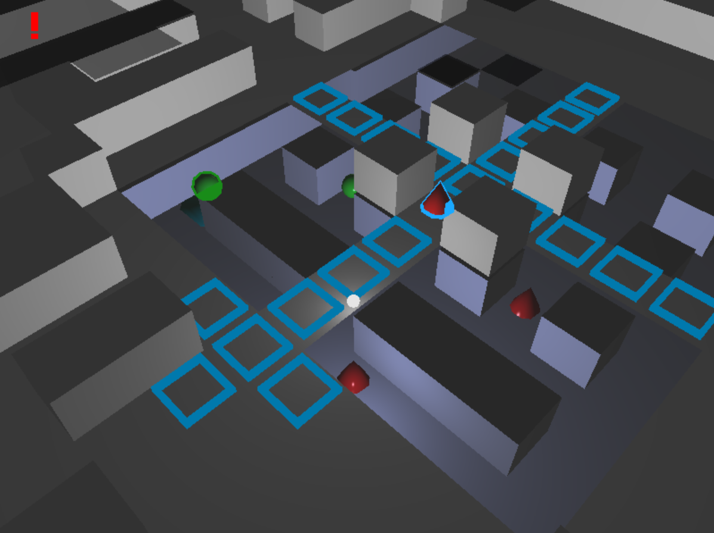

# Tactics Game

Project for my Bachelor's thesis *"Gra turowa na trójwymiarowej mapie zaimplementowana z wykorzystaniem OpenGL"* (eng. *"Turn-based game on a 3D map implemented with OpenGL")*.

The game was mainly inspired by [XCOM: Enemy Unknown](https://store.steampowered.com/app/200510/XCOM_Enemy_Unknown/). The goal of the thesis was to write a game entirely from scratch using relatively low-level libraries like OpenGL. The game features a 3D map -- it is divided into floors. The units can move vertically at specified "ladder" points and shoot lower/higher units through holes in the floors.

Below you will find a simplified description of the game. If you're interested in the technical documentation and more detailed description, you can download the thesis PDF from the [release page](https://github.com/MrSimbax/tactics_game/releases/tag/v1.0.1). Unfortunately, it is only available in Polish and currently I have no plans for translating it.

## Screenshots





## Gameplay video

[](https://www.youtube.com/watch?v=SXdtPCDJeSc)

## Download

Windows 64-bit executable and Linux 64-bit [AppImage](https://appimage.org/) can be downloaded from the [release page](https://github.com/MrSimbax/tactics_game/releases/latest).

### Requirements

The game requires a graphics card with support for OpenGL 3.3.

## How to Play

The controls can be viewed by pressing the `H` button on your keyboard.

The game is a local multiplayer turn-based tactical game for 2 players. The goal is to destroy all of the opponent's units.

In each turn the current player can order their units to either move or shoot. Each unit starts with 2 action points at the beginning of a turn: a move costs 1 action point, while shooting costs all the available points (1 or 2). A turn can be ended anytime. Once a turn ends, the opponent's turn begins.

Units have only 1 hit point. Shooting results in destroying a unit with some probability. The probability depends on several factors:

* The taxi distance between the shooter and the target.
* The difference in height between the shooter and the target (that is whether the shooter has the high ground).
* Whether the target is hidden behind cover from the perspective of the shooter.

As you can see, the mechanics are quite simple and resemble a vastly simplified XCOM.

## Maps

In folder `assets/maps` there are example maps to play the game on. The default map is named `demo`. You can change the map by specifying a command line argument to run the game. For example, running the following command will run the map defined in the folder `assets/map/city`:

```
./tactics_game --map=city
```

## Options

You can see the available options like enabling vsync, fullscreen mode or antialiasing by passing the `-h` argument to the command line.

```
$ ./tactics_game -h
2020-04-21 03:32:13.096 INFO  [21044] [init_logger@20] Logger is working.
2020-04-21 03:32:13.097 INFO  [21044] [tactics_game::game_application::init_options@43]   ./tactics_game {OPTIONS}

    Tactics Game

  OPTIONS:

      -h, --help                        Display this help menu
      --vsync                           Vertical synchronization on
      -f, --fullscreen                  Fullscreen on
      --aa                              Anti-aliasing on
      -d[assets_dir],
      --assets-dir=[assets_dir]         Path to assets directory (default:
                                        {basedir}/assets)
      --map=[map_name]                  Loads the map with given name (from
                                        assets/maps/map_name directory)
```

# Modding the Game

The game uses files in the `assets` folder. They are mostly text files hence the user can modify them or add new ones without much hassle. The provided default assets should be good enough as self-explanatory examples for anyone interested in modding the game. 

## Maps

Each map is contained in its own folder inside `assets\maps` and consists of two types of files:

* `map.json` -- describes the necessary metadata for the game, like the map size, positions of units and lights.
* `{i}.layer`, `0 <= i <= size.y`, where `size.y` is defined in `map.json` -- describes the layout of each floor.

The `layer` files are text files with `size.x` lines and `size.z` columns of digits from 0-3. A digit at position `(x,z)` represents the type of tile at this position. Digit 0 is an empty tile, digit 1 is a floor tile, digit 2 is a wall and digit 3 is a ladder.

## Models

The models are in Wavefront OBJ format. The game requires the model files to have normals, materials in the MTL format and triangulated faces. As long as they satisfy these requirements, the engine should be able to handle them. The provided models were created and exported by using Blender.

# How to Build

The game uses [`cmake`](https://cmake.org/) as the build manager.

The recommended build configuration is 64-bit, with static linking and release (or debug for development) build type. Here are some the flags which can be provided for `cmake`:

* `-DCMAKE_BUILD_TYPE={Release|Debug}`
* `-DBUILD_STATIC={1|0}` -- `1` by default.

## Windows

The recommended way to build the game is to use the [`vcpkg`](https://github.com/Microsoft/vcpkg) package manager and Microsoft Visual Studio at least 2017. The following command will install all the necessary external dependencies:

```
./vcpkg install sdl2 assimp zlib --triplet=x64-windows-static
```

You will need to provide the following flags to CMake:

* `−DCMAKE_TOOLCHAIN_FILE={PATH_TO_VCPKG\\scripts\\buildsystems\\vcpkg.cmake}`
* `−DVCPKG_TARGET_TRIPLET={TRIPLET}` -- for example `x64-windows-static`.

## Linux

You can either use `vcpkg` or install the dependencies using your distribution's package manager. Then simply run `cmake` and `make`. For instance 

```
mkdir build
cd build
cmake -DCMAKE_BUILD_TYPE=Release -DCMAKE_TOOLCHAIN_FILE=~/vcpkg/scripts/buildsystems/vcpkg.cmake ..
make
```

In order to create an AppImage you can run the provided script `deploy_linux.sh`.

## Dependencies

You need to have the following dependencies installed:

* [`SDL2`](https://www.libsdl.org/) -- creating the window, input handling, etc.
* [`assimp`](http://www.assimp.org/) -- 3D models loading
* [`zlib`](https://zlib.net/) -- `assimp` dependency

For debug Windows builds the following is recommended:
* [`Visual Leak Detector`](https://kinddragon.github.io/vld/) -- reports any detected memory leaks

Only 2-3 memory leaks are detected and as far as I'm aware, they're the result of using the SDL library. So far so good.

The game also uses the following libraries but they are provided in the source code directly mostly unmodified:

* [`glad`](https://glad.dav1d.de/) -- the OpenGL functions
* [`plog`](https://github.com/SergiusTheBest/plog) -- logging
* [`glm`](https://glm.g-truc.net/0.9.9/index.html) -- mathematical operations
* [`irrxml`](https://www.ambiera.com/irrxml/) -- another `assimp` dependency
* [`nlohmann-json`](https://github.com/nlohmann/json) -- JSON files
* [`args`](https://github.com/Taywee/args) -- command line arguments
* [`boxer`](https://github.com/aaronmjacobs/Boxer) -- popup windows

### Modified dependencies

The `plog` library was slightly modified because the `ReSharper C++` intellisense was reporting some false-positive errors.
The modified revision in [95d28c24d102973e0cb6b7f6084144a7401b5671](https://github.com/SergiusTheBest/plog/commit/95d28c24d102973e0cb6b7f6084144a7401b5671).
Here's the diff:

```
$ diff ../../../../Desktop/plog-master/include/plog plog/
Common subdirectories: ../../../../Desktop/plog-master/include/plog/Appenders and plog/Appenders
Common subdirectories: ../../../../Desktop/plog-master/include/plog/Converters and plog/Converters
Common subdirectories: ../../../../Desktop/plog-master/include/plog/Formatters and plog/Formatters
diff ../../../../Desktop/plog-master/include/plog/Log.h plog/Log.h
13c13
< #if defined(_MSC_VER) && _MSC_VER >= 1600 && !defined(__INTELLISENSE__) && !defined(__INTEL_COMPILER) && !defined(__llvm__) // >= Visual Studio 2010, skip IntelliSense, Intel Compiler and Clang Code Model
---
> #if defined(_MSC_VER) && _MSC_VER >= 1600 && !defined(__INTELLISENSE__) && !defined(__INTEL_COMPILER) && !defined(__llvm__) && !defined(__RESHARPER__) // >= Visual Studio 2010, skip IntelliSense, Intel Compiler and Clang Code Model
```

# License

GPLv3, see the `LICENSE` file for details.
